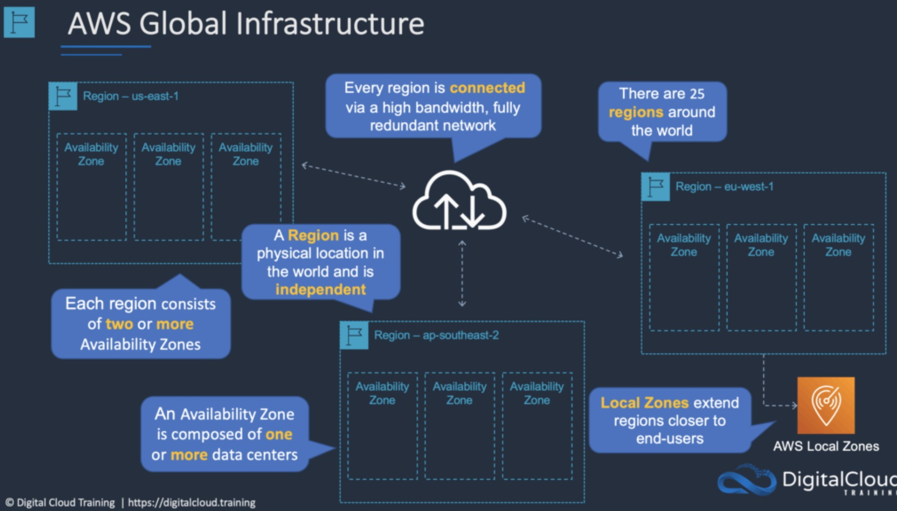

# ☁️ AWS Cloud Practitioner: Módulo 01 - Introducción a la nube

**Fecha:** 29 de enero de 2026
**Estado:** Finalizado ✅

## 🎯 Objetivos del Módulo
* Entender qué es el Cloud Computing.
* Diferenciar entre modelos de despliegue.
* Definicion y beneficios de la nube.
* Conocer la infraestructura global de AWS.
* Exlplorar el modelo de responsabilidad compartida AWS.

## 📝 Resumen Técnico
La nube de AWS permite cambiar gastos de capital por gastos variable, con amplitud de posisbilidades e innovacion.

### Conceptos Clave
1. **Pago por uso:** Solo pagar por lo que consumes.
2. **Agilidad:**  Desplegar recursos en minutos.
3. **Elasticidad:** Expansion con vista casi infinita en torno a lo finito del hardware fisico.
4. **Ahorros:** Remplazon de los gastos fijos por variables.
5. **Implementacion:** Velocidad extrema para la aplicacion en escala global de servicios.

## 🖼️ Diagrama / Evidencia

